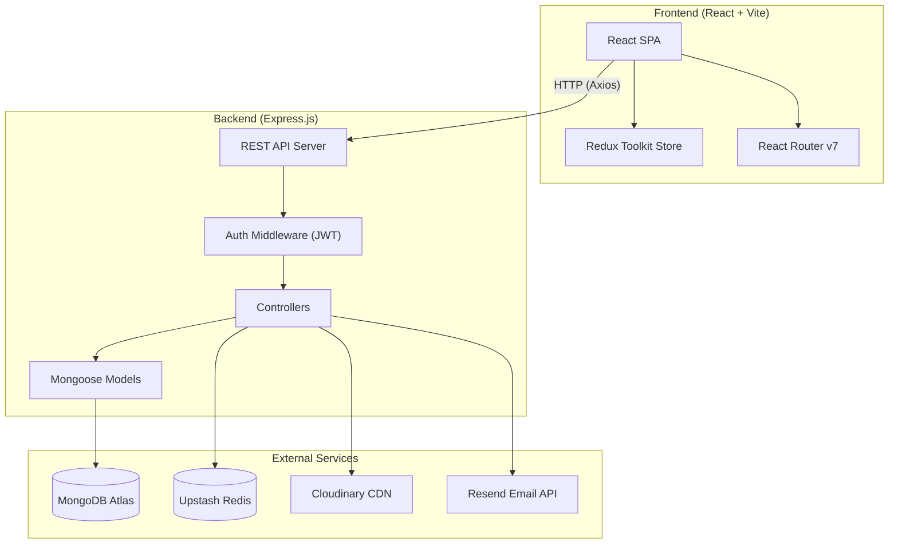
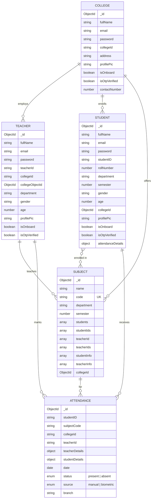
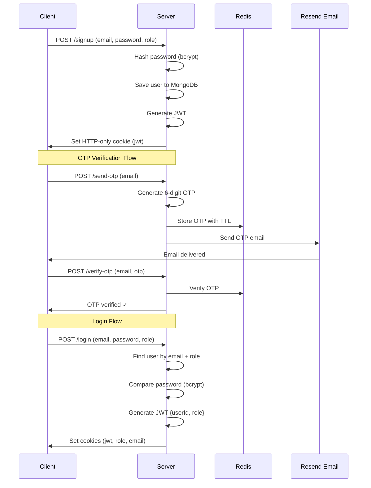
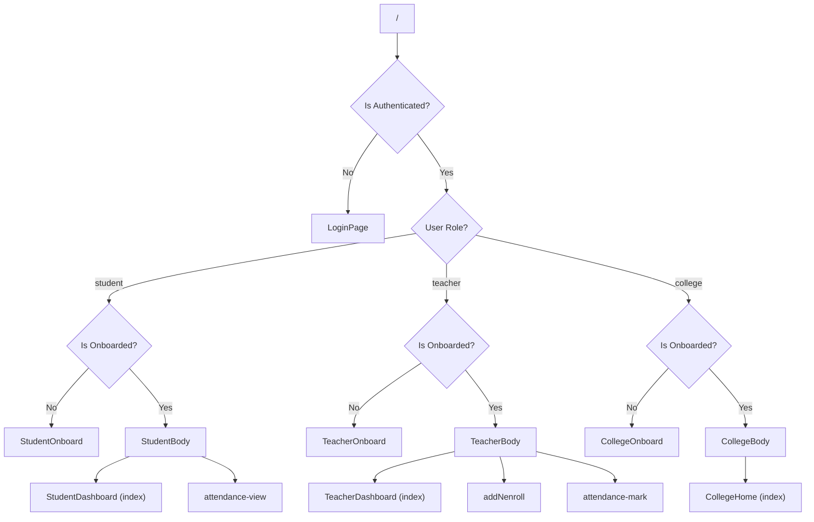
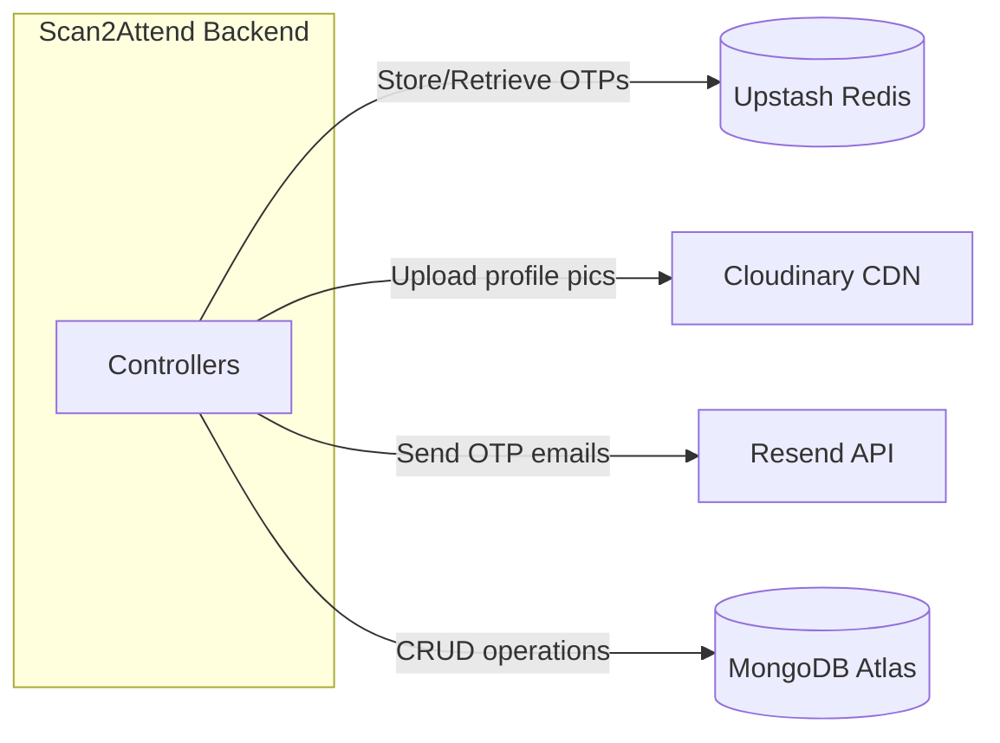
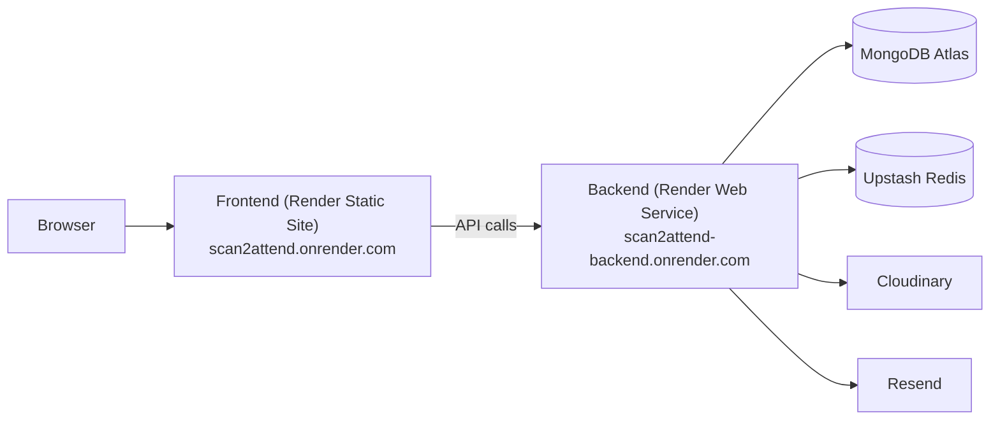

# Scan2Attend — System Design Overview

**Scan2Attend** is a full-stack web application for college attendance management. It supports three user roles — **College**, **Teacher**, and **Student** — each with distinct dashboards, capabilities, and data flows.

---

## High-Level Architecture



---

## Technology Stack

| Layer | Technology | Purpose |
|-------|-----------|---------|
| **Frontend Framework** | React 19 + Vite 7 | SPA with fast HMR |
| **State Management** | Redux Toolkit | Global auth, user, and theme state |
| **Routing** | React Router v7 | Client-side routing with role-based guards |
| **UI Libraries** | MUI v7, DaisyUI, TailwindCSS, Lucide React, React Icons | Component library & styling |
| **Tables** | TanStack React Table, AG Grid | Data grids for attendance & enrollment |
| **Backend Runtime** | Node.js + Express 5 | REST API server |
| **Database** | MongoDB (Mongoose ODM) | Primary data store |
| **Cache / OTP Store** | Upstash Redis | OTP storage with TTL for verification |
| **File Storage** | Cloudinary | Profile picture & media uploads |
| **Email Service** | Resend | OTP delivery and transactional emails |
| **Auth** | JWT (HTTP-only cookies) + bcryptjs | Session management & password hashing |
| **File Uploads** | Multer | Multipart form data handling |
| **Deployment** | Render | Hosting (both frontend & backend) |

---

## Data Model (Entity Relationships)



> [!NOTE]
> The Attendance model has a **compound unique index** on `(studentID, subjectCode, date)` to prevent duplicate entries for the same student-subject-day combination.

---

## Backend Architecture

### Directory Structure

```
backend/
├── src/
│   ├── server.js              # Express app entry point
│   ├── config/
│   │   ├── cloudinary.js      # Cloudinary upload helper
│   │   ├── redis.js           # Upstash Redis client
│   │   ├── resend.js          # Resend email client
│   │   └── mail.js            # Email templates / sender
│   ├── lib/
│   │   ├── db.js              # MongoDB connection
│   │   └── redisClient.js     # Redis client (alternative)
│   ├── middleware/
│   │   ├── authMiddleware.js  # JWT verification + role resolution
│   │   └── multerMiddleware.js # File upload handling
│   ├── models/
│   │   ├── Attendance.js
│   │   ├── College.js
│   │   ├── Student.js
│   │   ├── Subject.js
│   │   └── Teacher.js
│   ├── controllers/
│   │   ├── authController.js       # Signup, login, logout, OTP, password reset, addUser, onboard
│   │   ├── attendanceController.js # Mark, view, update attendance
│   │   ├── profileController.js    # Fetch user profile
│   │   └── subjectController.js    # Add subjects, enroll students, get subjects
│   └── routes/
│       ├── auth.js
│       ├── attendance.js
│       ├── profile.js
│       └── subject.js
```

### API Routes

| Method | Endpoint | Auth | Description |
|--------|----------|------|-------------|
| `POST` | `/api/auth/signup` | ✗ | Register new user (student/teacher/college) |
| `POST` | `/api/auth/login` | ✗ | Login with email/password |
| `POST` | `/api/auth/logout` | ✗ | Clear JWT cookie |
| `POST` | `/api/auth/send-otp` | ✗ | Send OTP to email |
| `POST` | `/api/auth/verify-otp` | ✗ | Verify OTP code |
| `POST` | `/api/auth/reset-password` | ✗ | Reset password |
| `POST` | `/api/auth/onboard` | ✓ | Complete onboarding (with profile pic upload) |
| `POST` | `/api/auth/addUser` | ✓ | College adds teacher/student users |
| `POST` | `/api/profile/user` | ✓ | Get authenticated user profile |
| `POST` | `/api/subject/add` | ✓ | Create a new subject |
| `POST` | `/api/subject/enroll` | ✓ | Enroll students into a subject |
| `POST` | `/api/subject/get-subjects/` | ✓ | Get subjects for current user |
| `POST` | `/api/subject/get-subjects/:id` | ✓ | Get subjects by user ID |
| `POST` | `/api/attendance/mark` | ✓ | Mark attendance for students |
| `POST` | `/api/attendance/mark/:id` | ✓ | Mark attendance (alternate) |
| `GET`  | `/api/attendance/view` | ✓ | View attendance records |
| `PUT`  | `/api/attendance/update` | ✓ | Update attendance records |

### Authentication Flow



### Auth Middleware Logic

The [authMiddleware.js](file:///c:/Users/amand/OneDrive/Documents/Project/Scan2Attend/backend/src/middleware/authMiddleware.js) performs:
1. Extracts JWT from `req.cookies.jwt`
2. Verifies the token using `JWT_SECRET_KEY`
3. Resolves the user from the correct model based on `role` (student/teacher/college)
4. Attaches `req.user`, `req.role`, `req.id`, and `req.objectId` to the request

---

## Frontend Architecture

### Directory Structure

```
frontend/Scan2Attend/src/
├── App.jsx                    # Root component with route definitions
├── main.jsx                   # React entry point (Provider + Router)
├── index.css                  # Global styles
├── store/
│   ├── appStore.js            # Redux store configuration
│   ├── authSlice.js           # Auth state (isAuthenticated, role, onboard)
│   ├── userSlice.js           # User profile data
│   └── themeSlice.js          # Theme toggle state
├── AuthPages/
│   ├── LoginPage.jsx
│   ├── SignUpPage.jsx
│   ├── ForgotPasswordPage.jsx
│   ├── NewPasswordPage.jsx
│   └── OtpPage.jsx
├── CollegePages/
│   ├── CollegeBody.jsx        # Layout wrapper
│   ├── CollegeHome.jsx        # Dashboard
│   ├── CollegeNavbar.jsx
│   ├── CollegeSidebar.jsx
│   └── CollegeOnboard.jsx
├── TeacherPages/
│   ├── TeacherBody.jsx        # Layout wrapper
│   ├── TeacherDashboard.jsx
│   ├── TeacherMarkAttendance.jsx  # Core attendance marking
│   ├── AddSubNEnrollStud.jsx      # Subject & enrollment management
│   ├── TeacherNavbar.jsx
│   ├── TeacherSidebar.jsx
│   └── TeacherOnboard.jsx
├── StudentPages/
│   ├── StudentBody.jsx        # Layout wrapper
│   ├── StudentDashboard.jsx
│   ├── StudentAttendanceView.jsx  # View attendance records
│   ├── StudentNavbar.jsx
│   ├── StudentSidebar.jsx
│   └── StudentOnboard.jsx
├── components/
│   ├── Navbar.jsx             # Shared navbar
│   ├── Sidebar.jsx            # Shared sidebar
│   ├── AddUser.jsx            # Modal for college to add users
│   ├── PhotoCrop.jsx          # Image cropping for profile pics
│   ├── TagInput.jsx           # Tag-style input component
│   └── ThemeSelector.jsx      # Theme toggle
├── hooks/                     # Custom React hooks
├── constants/                 # App constants
├── lib/                       # Utility libraries
├── utils/                     # Helper functions
└── Images/                    # Static image assets
```

### Routing & Role-Based Access Control



### State Management (Redux)

| Slice | State | Purpose |
|-------|-------|---------|
| **authSlice** | `isAuthenticated`, `isRole`, `isOnboarded` | Persisted to `localStorage`; drives route guards |
| **userSlice** | `userData` | Current user's profile (fetched from API / localStorage) |
| **themeSlice** | `currentTheme` | DaisyUI theme (e.g., light/dark); persisted to localStorage |

---

## Key User Flows

### 1. College Admin Flow
1. **Sign up** → OTP verification → **Onboard** (college name, ID, address, profile pic)
2. **Add Users** — college can create teacher & student accounts with temporary passwords
3. **Dashboard** — overview of college data

### 2. Teacher Flow
1. **Login** (account created by college, or self-signup) → Onboard if needed
2. **Add Subjects** — create subjects with code, name, department, semester
3. **Enroll Students** — assign students to subjects
4. **Mark Attendance** — select subject → select date → mark students present/absent (manual or biometric source)
5. **Dashboard** — view assigned subjects and attendance stats

### 3. Student Flow
1. **Login** → Onboard if needed
2. **Dashboard** — overview of enrolled subjects
3. **View Attendance** — see per-subject attendance records and percentage

---

## External Services Integration



| Service | Usage | Configuration |
|---------|-------|---------------|
| **MongoDB Atlas** | Primary database for all entities | Connection via `MONGODB_URI` env var |
| **Upstash Redis** | OTP storage with auto-expiry (TTL) | REST-based Redis via `UPSTASH_REDIS_REST_URL` |
| **Cloudinary** | Profile picture uploads with CDN delivery | Configured via `CLOUDINARY_NAME`, `API_KEY`, `API_SECRET` |
| **Resend** | Transactional email delivery (OTPs) | Configured via `RESEND_API_KEY` |

---

## Deployment Architecture



- **Frontend**: Deployed as a static site on Render, built with `vite build`
- **Backend**: Deployed as a Node.js web service on Render
- **CORS**: Backend allows origins `http://localhost:5173` (dev) and `https://scan2attend.onrender.com` (prod)
- **Cookies**: HTTP-only JWT cookies with `credentials: true` for cross-origin auth

---

## Security Design

| Aspect | Implementation |
|--------|---------------|
| **Password Storage** | bcrypt with salt rounds = 10, hashed via Mongoose `pre("save")` hook |
| **Session Management** | JWT stored in HTTP-only cookies (not localStorage) |
| **OTP Verification** | Time-limited OTPs stored in Redis with TTL |
| **CORS** | Whitelist-based origin validation |
| **Token Expiry Handling** | Auth middleware clears cookies on `TokenExpiredError` |
| **Input Validation** | Mongoose schema validators (gender enum, minlength on password) |
| **File Upload Safety** | Multer middleware for controlled file handling; Cloudinary for storage |

---

## Design Patterns

| Pattern | Where |
|---------|-------|
| **MVC** | Models → Controllers → Routes (backend) |
| **Role-based polymorphic auth** | Single auth middleware resolves user from 3 different models based on JWT role |
| **Onboarding gate** | Frontend route guards check `isOnboarded` before granting dashboard access |
| **Denormalized embedded data** | Attendance records embed `teacherDetails` and `studentDetails` snapshots for fast reads |
| **Compound unique index** | `(studentID, subjectCode, date)` prevents duplicate attendance entries |
| **Redux persistence** | Auth/user/theme state synced to `localStorage` for session continuity |
